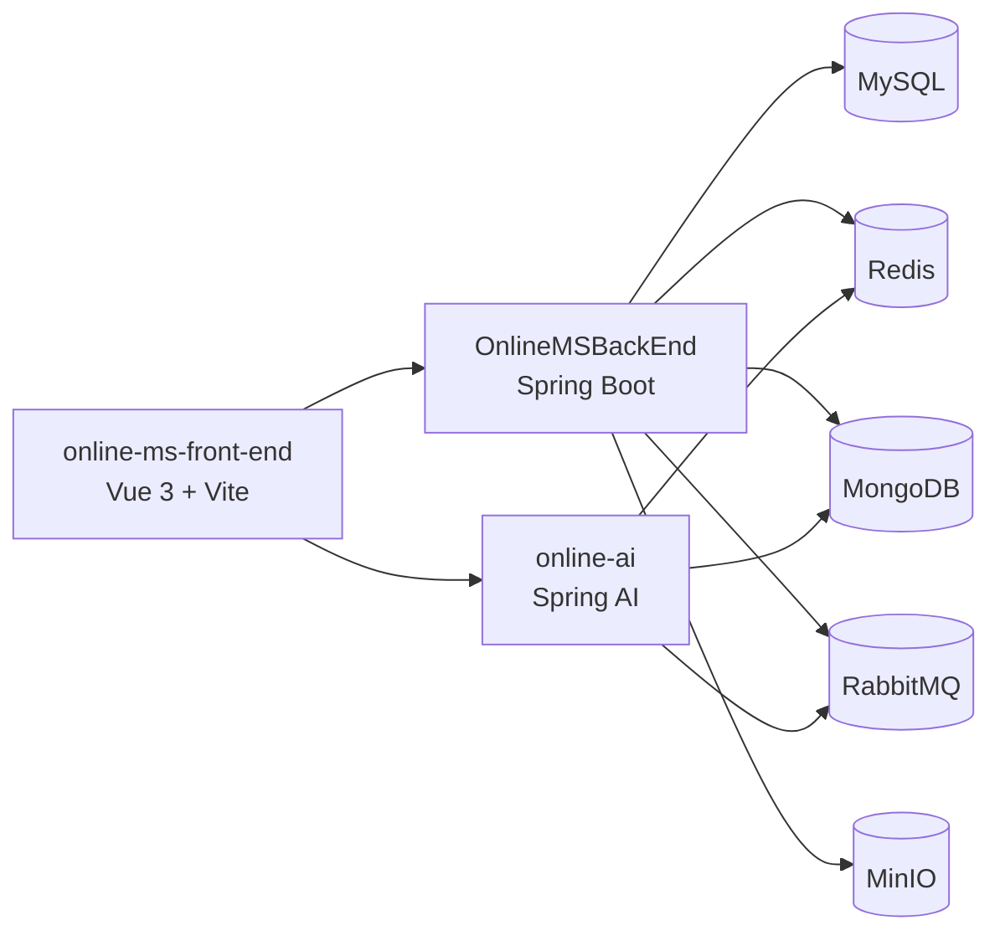

<p align="center">
  
</p>

# Online Education

**基于 Spring Boot 3.5 + Vue 3 的在线教育平台聚合工程**

覆盖学生端、教师端、管理端，以及独立的 AI 对话与治理服务。


---

## 项目概览

本仓库是一个 Maven 聚合工程，根模块为 `OnlineEducation`，当前包含以下核心组成：

| 模块 | 路径 | 说明 |
| --- | --- | --- |
| 主业务后端 | `OnlineMSBackEnd` | Spring Boot 主服务，负责用户、课程、学习、测评、阅卷、通知、后台管理等业务接口 |
| AI 服务 | `online-ai` | 独立 Spring Boot AI 服务，负责学生/教师 AI 对话、会话历史、标签解析、AI 治理 |
| 前端应用 | `online-ms-front-end` | Vue 3 + Vite 单页应用，覆盖学生端、教师端、管理端页面 |
| 公开补充文档 | `docs/public` | 面向 GitHub 的运行说明、主业务后端 API 文档与 AI 服务 API 文档 |
| 数据库结构 | `sql/MySQL/online_educate.sql` | 当前公开仓库中提供的主库结构脚本 |

## 当前功能边界

### 学生端

- 课程浏览、课程详情、分类查询、关键字搜索与报名
- 课程学习、章节内容拉取、学习进度更新、课件与资料访问
- 测评列表、考试作答、考试开始校验与试卷获取
- 学习笔记、收纳箱、课程维度笔记归档
- 课程讨论区、提问、回复、点赞与置顶内容浏览
- 学生聊天、好友相关接口与统一通知中心页面
- 学生 AI 对话、流式返回、历史会话与消息分页

### 教师端

- 教师工作台与周概览
- 课程创建、编辑、封面上传、发布、归档、课程属性维护
- 课程大纲、章节与小节管理、课程资料上传与文件下载
- 题库管理、试卷中心、考试管理、结果汇总
- 阅卷任务、题目级批改、沉浸式阅卷页面
- 教师资料页、设置页、数据分析页、教师聊天与通知中心
- 教师 AI 助手、优化助手、需求补充问答与历史会话
- 教师待办接口

### 管理端

- 管理后台概览
- 用户管理、状态维护、用户详情、密码重置与恢复
- 课程分类管理与迁移相关接口
- 审计日志、系统公告与统计接口
- AI 治理总览、调用记录、配额策略、运行时策略、人工审核

### AI 服务特性

- 学生端与教师端均提供 SSE 流式对话接口
- 支持会话摘要、消息分页、按会话查询历史记录
- 提供标签解析工具接口
- 治理侧已经收敛到运行时策略、配额控制、审核、重试与平台回退
- 配置中已接入 OpenAI、DeepSeek、DashScope 相关能力与 Redis 向量存储依赖

### 通知中心

- 统一通知中心后端位于主业务后端
- 当前通知中心采用站内持久化方案，不依赖 WebSocket 实时推送
- 已接入系统公告、测评发布、阅卷完成、课程信息与课程状态变更等事件

## 技术栈

| 层级 | 已验证技术 |
| --- | --- |
| 前端 | Vue 3、Vue Router、Pinia、Vite、Element Plus、Axios、Chart.js、Markdown-It、KaTeX、GSAP |
| 主业务后端 | Spring Boot、Spring Security、MyBatis、JDBC、Validation、Mail、WebSocket、RabbitMQ、Redis、MongoDB、MinIO、JWT、Actuator |
| AI 后端 | Spring Boot、Spring AI、DashScope、DeepSeek、Reactive MongoDB、Redis、RabbitMQ、JWT、HanLP |
| 工程组织 | Maven 聚合工程，根 `pom.xml` 管理 `OnlineMSBackEnd` 与 `online-ai` 两个 Java 模块 |

## 数据库结构摘要

当前公开仓库直接提供主库结构文件 `sql/MySQL/online_educate.sql`，其中已经覆盖以下核心领域：

- 用户与身份：`users`、`user_describe`、`user_relationships`
- 课程体系：`courses`、`course_categories`、`course_properties`、`course_instructor`
- 教学内容：`chapters`、`sections`、`course_materials`、`files`
- 学习与选课：`user_courses`、`learning_progress`
- 测评与评分：`assessments`、`course_ratings`、`teacher_ratings`、`rating_dimensions`、`rating_statistics`
- 运营与治理：`system_announcements`、`audit_logs`、`teacher_todos`、`user_notifications`
- 统计增强：课程资料、文件、课程评分、讲师评分相关视图与评分统计触发器

如果需要查看完整表结构、索引、视图与触发器定义，可直接阅读 [sql/MySQL/online_educate.sql](./sql/MySQL/online_educate.sql)。

## 架构关系



## 目录速览

```text
OnlineEducation/
├─ OnlineMSBackEnd/          # 主业务后端
├─ online-ai/                # 独立 AI 服务
├─ online-ms-front-end/      # Vue 前端
├─ docs/public/              # 面向 GitHub 的公开补充文档
├─ sql/MySQL/                # 当前公开的数据库结构脚本
├─ log/                      # 运行日志
├─ pom.xml                   # Maven 聚合工程入口
└─ package.json              # 根目录前端依赖补充
```

## 启动说明

### 1. 基础准备

- Java 21
- Maven
- Node.js 与 npm
- MySQL
- Redis
- MongoDB
- RabbitMQ
- MinIO

### 2. 配置说明

根工程下两个 Spring Boot 服务默认启用 `local` profile。

- `OnlineMSBackEnd/src/main/resources/application.yml` 使用环境变量注入数据库、缓存、消息队列、邮件、JWT 与 MinIO 配置
- `online-ai/src/main/resources/application.yml` 使用环境变量注入 Redis、MongoDB、RabbitMQ、JWT 与 AI 平台配置
- 仓库中存在 `application-local.yml`，本地启动前应按自己的环境替换其中的地址、账号、密钥等敏感配置，不建议直接复用

常见变量分组如下：

- `SPRING_DATASOURCE_*`
- `SPRING_DATA_REDIS_*`
- `SPRING_DATA_MONGODB_*`
- `SPRING_RABBITMQ_*`
- `SPRING_MAIL_*`
- `SPRING_SECURITY_JWT_KEY`
- `APP_FILE_STORAGE_MINIO_*`
- `SPRING_AI_OPENAI_*`
- `SPRING_AI_DASHSCOPE_*`
- `SPRING_AI_DEEPSEEK_*`

### 3. 构建工程

```bash
mvn clean install
```

### 4. 启动主业务后端

```bash
mvn -pl OnlineMSBackEnd spring-boot:run
```

说明：该模块未在配置文件中显式声明 `server.port`，未额外覆盖时将使用 Spring Boot 默认端口 `8080`。

### 5. 启动 AI 服务

```bash
mvn -pl online-ai spring-boot:run
```

说明：AI 服务在配置中显式声明端口 `8088`。

### 6. 启动前端

```bash
cd online-ms-front-end
npm install
npm run dev
```

说明：Vite 配置中未显式指定端口，开发模式下默认使用 `5173`。

更完整的公开部署与配置说明可查看 [docs/public/SETUP.md](./docs/public/SETUP.md)。

## 接口入口概览

| 场景 | 已验证前缀 |
| --- | --- |
| 公共接口 | `/api/public` |
| 学生业务 | `/api/student` |
| 学生课程与学习 | `/api/student/course`、`/api/student/learning` |
| 学生测评与讨论 | `/api/student/assessments`、`/api/student/discussions` |
| 学生聊天 | `/api/student/chat` |
| 教师业务 | `/api/teacher` |
| 教师课程与阅卷 | `/api/teacher/courses`、`/api/teacher/grading` |
| 教师题库与试卷 | `/api/teacher/questions`、`/api/teacher/paper` |
| 教师待办 | `/api/teacher/todos` |
| 统一通知中心 | `/api/notifications` |
| 管理后台 | `/api/admin` |
| 管理端 AI 治理 | `/api/admin/ai/governance` |
| 学生 AI | `/api/students/ai` |
| 学生 AI 工具 | `/api/students/ai/tool` |
| 教师 AI | `/api/teacher/ai` |

当前公开仓库中的接口文档已经按服务拆分：

- 主业务后端接口文档对应 `OnlineMSBackEnd`，默认示例地址为 `http://localhost:8080`
- AI 服务与治理接口文档对应 `online-ai`，默认示例地址为 `http://localhost:8088`

## 公开资料

- [公开部署说明](./docs/public/SETUP.md)
- [主业务后端 API 文档](./docs/public/%E4%B8%BB%E4%B8%9A%E5%8A%A1%E5%90%8E%E7%AB%AF%20API%20%E6%96%87%E6%A1%A3.md)
- [AI 服务与治理 API 文档](./docs/public/AI%20%E6%9C%8D%E5%8A%A1%E4%B8%8E%E6%B2%BB%E7%90%86%20API%20%E6%96%87%E6%A1%A3.md)
- [主库结构 SQL](./sql/MySQL/online_educate.sql)

## 说明

- `target/` 与 `log/` 目录为构建产物和运行日志目录
- 前端当前 `README.md` 仍保留 Vite 模板内容，根目录 README 已作为本仓库总入口说明
- 内部设计、评审与过程性技术文档不作为 GitHub 公开仓库内容的一部分，公开说明统一收敛在当前 README 与 `docs/public` 目录
- `docs/public` 下的接口文档已转为公开仓库导向的说明方式，优先表达服务边界、入口与调用方式


